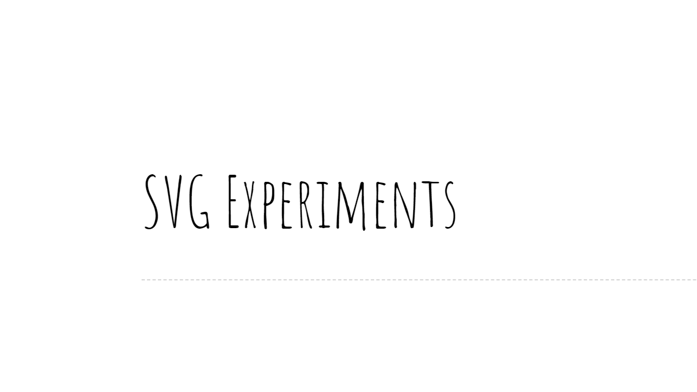

# SVG Experiments

A [gallery](https://diegoinacio.github.io/svg-experiments/) of experiments with _Scalable Vector Graphics_ (SVG) and interactive visualizations.

If you feel that something here has helped you in somehow, please consider [supporting](https://ko-fi.com/diegoinacio/) this project:

## List of experiments

| Experiment | Name                                      | Description                                        |
| :--------: | ----------------------------------------- | -------------------------------------------------- |
|    001     | [Concentric Squares](svg-experiment-001/) | Randomly rotated, inscribed and concentric squares |
|    002     | [Gradient Lines](svg-experiment-002/)     | Horizontal gradient lines                          |
|    003     | [Parallax Bokeh](svg-experiment-003/)     | Interactive _Bokeh_ effect with parallax illusion  |
|    004     | [MPHS DSGN](svg-experiment-004/)          | Abstract _Memphis Design_ (80s feelings)           |
|    005     | [PseuDoF](svg-experiment-005/)            | Interactive pseudo _Depth of Field_ effect         |
|    006     | [CellAuto](svg-experiment-006/)           | Parameterized one-dimensional _Cellular Automaton_ |

Made with ❤️ by [Diego Inácio](https://diegoinacio.github.io/)
